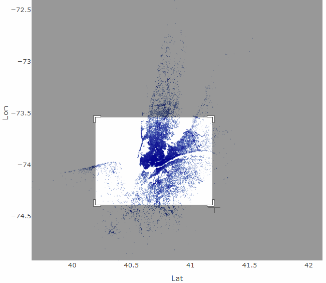

# Rasterizer

Display million data in seconds in R

## Load large data in R

`rasterizer` is a R package to display large data set (million or billion) in seconds. 
Here are a couple of ways to load large data in R with package `data.table` (https://cran.r-project.org/web/packages/data.table/vignettes/datatable-intro.html).

* csv file:
```
library(data.table)
data <- data.table::fread("yourpath/somefile.csv") # or a link
```

* parquet file:
Parquet files can provide efficient data compression to save much more space. Package `reticulate` (https://rstudio.github.io/reticulate/) offers "pandas" library (from Python) in R, which can help load parquet files.
```
library(data.table)
library(reticulate)
library(magrittr)
pandas <- reticulate::import("pandas")
read_parquet <- function(path, columns = NULL) {
  if (!is.null(columns)) columns <- as.list(columns)
  path.expand(path) %>% 
      normalizePath() %>%
      pandas$read_parquet(., columns = columns) %>%
      data.table::as.data.table(., stringsAsFactors = FALSE)
}
data <- read_parquet("yourpath/somefile.parquet")
```
Note, make sure `NumPy` and `Pandas` are installed with latest version.

## Install

`rasterizer` can be installed directly from github

```
remotes::install_github("https://github.com/plotly/rasterizer")
```

## Use `rasterizer` to display large data set

`rasterizer` is built based on `datashader` http://datashader.org/getting_started/index.html in python. Both are designed by "rasterizing" large data set into images. In computation, `datashader` is faster but `rasterizer` is comparable; in usage, `rasterizer` provides more readable and flexible operation interface.

#### Basic usage

Data highlights Uber trips taken in New York City from April 1 2014 to September 30 2014 with 4533327 observations.
```
# Load data
ridesRaw_1 <- "https://raw.githubusercontent.com/plotly/datasets/master/uber-rides-data1.csv" %>%
  data.table::fread(stringsAsFactors = FALSE)
ridesRaw_2 <- "https://raw.githubusercontent.com/plotly/datasets/master/uber-rides-data2.csv" %>% 
  data.table::fread(stringsAsFactors = FALSE)
ridesRaw_3 <- "https://raw.githubusercontent.com/plotly/datasets/master/uber-rides-data3.csv"  %>% 
  data.table::fread(stringsAsFactors = FALSE)
ridesDf <- list(ridesRaw_1, ridesRaw_2, ridesRaw_3) %>% 
  data.table::rbindlist()
```

Start `rasterizer`
```
ridesDf %>%
  rasterizer(mapping = aes(x = Lat, y = Lon)) %>% 
  rasterize_points() -> p
p
```


Note that, "p" is a list of environments. The display info can be accessed through
```
r <- rasterizer_build(p)
str(r)
```
"r" contains image raster and other useful info (like numeric aggregation matrices) to produce image but it does **not** provide any graphs. Package `rasterizer` replies on the third parties to display like package `grid` and `ggplot` for static graphs or `plotly` and `loon` for interactive graphs.

#### Static graph

* `grid`
```
# same with plot(p)
p 
```
Also, more control can be achieved via
```
grid.rasterizer(p, title = "Uber", xlabel = "Lat", ylabel = "Lon")
```
check `help("grid.rasterizer")` or `help("plot.rasterizer")` for more info

* `ggplot`
```
ggplot(data, mapping) + 
  geom_rasterizer() # not yet finished, coming soon!
```

#### Interactive graph

* `plotly`
```
plot_ly(ridesDf, x = ~Lat, y = ~Lon) %>%
 add_rasterizer()
```


or

```
# Note that it may be deprecated in the future.
p %>% 
  plotly.rasterizer()
```


* `loon`
```
l_rasterizer(data, x, y) # not yet finished, coming soon!
```

## Apps

USA census app built by `dashR` can be found in https://github.com/plotly/rasterizer/tree/master/apps/UScensus